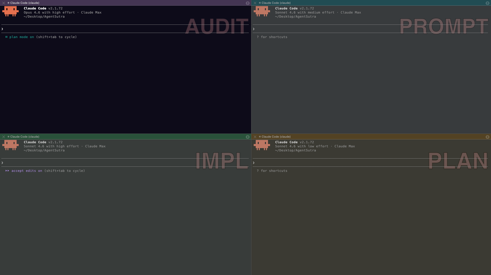
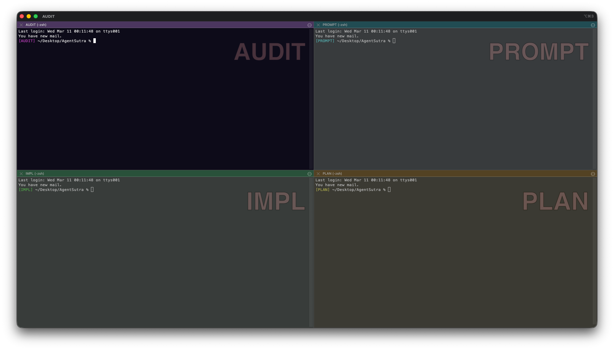

# 4-Pane Claude Code Setup for iTerm2

> Stop your AI agent from reviewing its own code — each pane runs a separate Claude Code session with a locked role, model, and permission set.

<em>Clean state on launch — colour-coded panes before any session starts</em>

Run 4 dedicated Claude Code sessions in a single iTerm2 window — each with its own role, model, effort level, and visual identity. One command (`cc`) launches the right configuration per pane.

**[Read the full guide with screenshots](https://pravindurgani.github.io/claude-code-multipane-iterm2/)**

---

## What you get

| Pane | Role | Model | Effort | Permission |
|------|------|-------|--------|------------|
| **AUDIT** | Code review (read-only) | Opus | high | `plan` |
| **IMPL** | Code writing & editing | Sonnet | high | `acceptEdits` |
| **PROMPT** | Prompt engineering | Sonnet | medium | default |
| **PLAN** | Architecture & planning | Sonnet | low | default |

**Why split it this way?**
- **Cost control** — Opus is ~15x more expensive than Sonnet. Reserve it for review only.
- **No self-grading** — The model that writes the code never reviews its own work.
- **Clean context** — Each pane has a focused, independent conversation window.
- **One-command launch** — A `cc` alias in your shell handles model, effort, and permissions automatically.
- **Safety hooks** — PreToolUse scripts block `.env` edits and `git push` before they happen; a circuit-breaker halts the session on repeated tool failures.

---

## Why iTerm2 (not macOS Terminal)?

This workflow depends on iTerm2-specific features:

| Feature | macOS Terminal | iTerm2 |
|---------|---------------|--------|
| Split panes | Tabs/windows only | Unlimited independent panes in one tab |
| Named profiles | No `$ITERM_PROFILE` env var | Auto-sets `$ITERM_PROFILE` per pane |
| Visual identity | Basic themes | Per-profile backgrounds, tab colours, badges |
| Saved layouts | Not supported | Save & auto-restore multi-pane arrangements |

`$ITERM_PROFILE` is the key — it's what lets the shell detect which role a pane has, even after restarting iTerm2 or restoring a saved layout.

---

## Prerequisites

- **macOS** (zsh is the default shell)
- **[iTerm2](https://iterm2.com/)** — required for split panes, named profiles, and saved layouts
- **[Claude Code CLI](https://docs.anthropic.com/en/docs/claude-code)** with an active subscription

---

## Quick start

> For detailed step-by-step instructions with screenshots, **[read the full guide](https://pravindurgani.github.io/claude-code-multipane-iterm2/)**.

1. **Create 4 iTerm2 profiles** — `DEV-AUDIT`, `DEV-IMPL`, `DEV-PROMPT`, `DEV-PLAN` — each with a distinct background colour and tab colour
2. **Set startup command & initial directory** — point each profile at your project folder
3. **Add the shell snippet to `~/.zshrc`** — copy-paste from [`zshrc-snippet.sh`](zshrc-snippet.sh)
4. **Create a 2x2 pane layout** and save it as the default window arrangement
5. **Type `cc` in each pane** — Claude Code launches with the correct flags
6. **Merge hooks config** — copy the four `.py` files from `hooks/` to `~/.claude/hooks/`; merge the `"hooks"` block from [`hooks/settings.json.example`](hooks/settings.json.example) into `~/.claude/settings.json`

---

## What's in this repo

| File | What it does |
|------|-------------|
| [`index.html`](index.html) | Full visual guide (the GitHub Pages site) |
| [`guide.md`](guide.md) | Markdown version for quick reference |
| [`zshrc-snippet.sh`](zshrc-snippet.sh) | Copy-paste block for your `~/.zshrc` |
| [`screenshots/`](screenshots/) | Step-by-step screenshots used in the guide |
| [`hooks/`](hooks/) | Python hook scripts for PreToolUse/PostToolUse safety enforcement |
| [`hooks/settings.json.example`](hooks/settings.json.example) | Hooks registration block to merge into `~/.claude/settings.json` |
| [`CLAUDE.md.template`](CLAUDE.md.template) | Starter template for global `~/.claude/CLAUDE.md` |
| [`REFERENCE.md.template`](REFERENCE.md.template) | Starter template for project-level `.claude/REFERENCE.md` |

---

## Adapting for your project

The setup is project-agnostic. To use it with a different codebase:

1. Update the **Initial Directory** in each profile to your project path
2. Optionally rename profiles with a project prefix (e.g. `MYPROJECT-AUDIT`) and add matching `case` entries to `~/.zshrc`
3. Save a separate window arrangement per project

**Session continuity:** Keep a `SESSION_LOG.md` in your project root. At the
start of each IMPL session, instruct Claude to read the last 60 lines and
resume from the most recent "Next:" item. See Step 13 in the full guide for
the minimal entry format.

**CLAUDE.md split:** Store global coding conventions in `~/.claude/CLAUDE.md`
and project-specific rules in `.claude/CLAUDE.md` (committed to the repo).
Claude Code merges both automatically. Use `CLAUDE.md.template` and
`REFERENCE.md.template` as starting points. See Step 14 in the full guide.

---

If this saves you time, a ⭐ helps others find it.

---

## License

[MIT](LICENSE)
