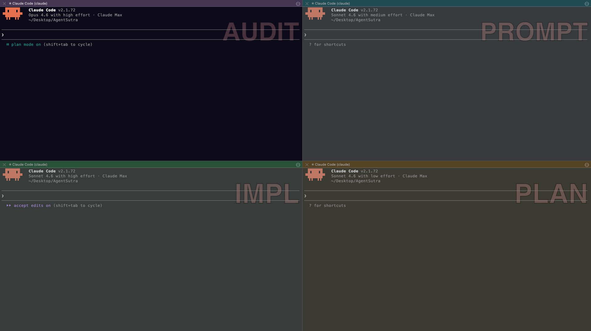

# A Disciplined Claude Code Workstation for iTerm2

> Four Claude Code sessions, four locked roles, one window. The reviewer runs read-only and cannot write files.

By [Prav Durgani](https://pravindurgani.com) · **[Read the full guide](https://pravindurgani.github.io/claude-code-multipane-iterm2/)**

Each pane is an independent Claude Code session with its own model, effort level and permission mode. One command, `cc`, launches the right configuration for whichever pane you are in. Setup takes about 45 minutes and adds no dependencies beyond iTerm2 and the Claude Code CLI.

---

## What you get

| Pane | Role | Model | Effort | Permission |
|------|------|-------|--------|------------|
| **AUDIT** | Code review, read-only | Opus | high | `plan` |
| **IMPL** | Writing and editing code | Sonnet | high | `acceptEdits` |
| **PROMPT** | Prompt engineering | Sonnet | medium | default |
| **PLAN** | Architecture and planning | Sonnet | low | default |

- **No self-grading.** The model that writes the code never reviews it.
- **Cost control.** Opus is roughly 15× the price of Sonnet per token, so it only runs in the review pane.
- **Enforced, not requested.** `--permission-mode plan` means the reviewer cannot write files, whatever it is asked to do. Hooks block `.env` edits and `git push` before they happen.
- **Clean context.** Four independent conversation windows, each focused on one job.
- **Survives a restart.** Saved iTerm2 arrangements bring the whole layout back.

---

## Why not just use agent teams?

Claude Code ships an experimental [agent teams](https://code.claude.com/docs/en/agent-teams) feature that can spawn teammates into iTerm2 or tmux split panes. It is excellent for short bursts of parallel exploration inside a single task.

It solves a different problem from this setup. Per the documentation, teammates *"start with the lead's permission mode"* and *"you can't set per-teammate permission modes at spawn time"*, so you cannot give one teammate a genuinely read-only reviewer role. Teammates also each carry their own context window, which costs significantly more tokens, and they are not restored by `/resume`.

Use agent teams when you want several agents attacking one problem for a few minutes. Use this when you want durable, separately-permissioned sessions you return to all day. They compose well together.

---

## Requirements

- macOS with zsh
- [iTerm2](https://iterm2.com/) — required, because `$ITERM_PROFILE` is what lets the shell detect which role a pane has
- [Claude Code CLI](https://code.claude.com/docs) with an active subscription

> **Windows and Linux:** not supported as written. A WSL2 and Windows Terminal port is plausible using `$WT_PROFILE_ID` as the role signal. Contributions welcome.

---

## Quick start

Full instructions, with screenshots, are in **[the guide](https://pravindurgani.github.io/claude-code-multipane-iterm2/)**. The short version:

1. **Install the prerequisites** — `brew install node iterm2` and `npm install -g @anthropic-ai/claude-code`, then `claude auth login`.
2. **Create four iTerm2 profiles** — `CC-AUDIT`, `CC-IMPL`, `CC-PROMPT`, `CC-PLAN`, each with its own background and tab colour.
3. **Set the startup command and initial directory** on each profile, pointing at your project.
4. **Add the shell snippet** from [`zshrc-snippet.sh`](zshrc-snippet.sh) to your `~/.zshrc`.
5. **Build a 2×2 layout** and save it as the default window arrangement.
6. **Type `cc` in each pane.** Claude Code starts with the right model, effort and permission mode.
7. **Install the safety hooks** — copy `circuit-breaker.py`, `protect-env.py`, `protect-git-push.py`, `session-start-reset.py` and `version-check.py` from [`hooks/`](hooks/) into `~/.claude/hooks/`, then merge the `hooks` block from [`hooks/settings.json.example`](hooks/settings.json.example) into `~/.claude/settings.json`.

Optional extras, each covered in the guide: an MCP server and slash commands, local models via Ollama, and shared persistent memory via [Sigil](https://github.com/Anmol-Srv/sigil).

---

## What's in this repo

| Path | What it does |
|------|-------------|
| [`index.html`](index.html) | The full visual guide, published via GitHub Pages |
| [`guide.md`](guide.md) | The same guide in Markdown |
| [`zshrc-snippet.sh`](zshrc-snippet.sh) | The block to paste into `~/.zshrc` |
| [`hooks/`](hooks/) | Safety hooks: `.env` protection, git-push gate, circuit breaker, version check |
| [`hooks/settings.json.example`](hooks/settings.json.example) | The hooks block to merge into `~/.claude/settings.json` |
| [`skills/`](skills/) | Skills for the review panes: code review, security audit, testing |
| [`commands/reflect.md`](commands/reflect.md) | `/reflect` — extracts what a session learned, for your `CLAUDE.md` |
| [`CLAUDE.md.template`](CLAUDE.md.template) | Starter for a global `~/.claude/CLAUDE.md` |
| [`REFERENCE.md.template`](REFERENCE.md.template) | Starter for a project `.claude/REFERENCE.md` |
| [`.mcp.json.example`](.mcp.json.example) | GitHub MCP server config, for `claude mcp add-json` |
| [`scripts/pane-logging.sh`](scripts/pane-logging.sh) | Turns iTerm2 session logging on or off for the four profiles |
| [`screenshots/`](screenshots/) | Images used by the guide |
| [`archive/handoff-2026-06/`](archive/handoff-2026-06/) | The retired pane-handoff feature, kept for reference |

---

## Adapting it to your project

The setup is project-agnostic. Point each profile's initial directory at the new codebase, and save a separate window arrangement per project. If you run several projects at once, rename the profiles with a project prefix such as `MYPROJECT-AUDIT` and add matching `case` entries to your `~/.zshrc`.

Two patterns in the guide travel with you: a `SESSION_LOG.md` so the next session knows where the last one stopped, and splitting your rules between a global `~/.claude/CLAUDE.md` and a project `AGENTS.md` so other agents read the same rules.

---

## What this is not

- **Not an orchestrator.** No daemons, no task queues, no dashboards. You drive it.
- **Not fire-and-forget.** It is a hands-on workflow with guardrails, not an autonomous loop.
- **Not a CI replacement.** The `gate` alias is a local check; your pipeline still runs.
- **Not cross-platform.** macOS and iTerm2 only.

---

## Archived

The **pane handoff** add-on, which routed directives between the AUDIT and IMPL panes automatically, was retired on 2026-09-21. Shared memory and a shared `AGENTS.md` replaced it. The implementation and its operator manual are preserved under [`archive/handoff-2026-06/`](archive/handoff-2026-06/README.md).

---

## Author

Built by **[Prav Durgani](https://pravindurgani.com)**, a London-based freelancer working on data and workflow automation, API integrations and AI tooling.

If this saved you time, a ⭐ helps other people find it.

## Licence

[MIT](LICENSE)
