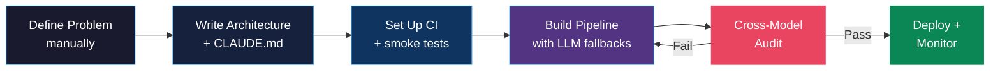

# How Prav Builds: An Engineering Process Audit

> A synthesis of build patterns, strengths, and gaps observed across 12 projects on Desktop — derived entirely from code, docs, and architecture artifacts.

**Date:** 2026-03-31  
**Projects analysed:** AgentSutra, claude-code-multipane-iterm2, reddit-harvest, commercial_content_tracker, affiliate-jobs-analysis-v4, sensispend-v2, portfolio_ideas, Work_Reports_iGB, ContentOS, igaming-intelligence-dashboard, claude_prompts, prompt_instructions

---

## 2. How I Build — The Mermaid Flowchart

```mermaid
flowchart TD
    subgraph PROMPTING["Phase 1: Prompting"]
        A1[Identify problem + define scope] --> A2[Write structured prompt<br/>with role, context, constraints]
        A2 --> A3[Reference exact files,<br/>line numbers, existing code]
        A3 --> A4[Create CLAUDE.md / project instructions<br/>with invariants + hard rules]
        A4 --> A5[Add category-specific prompt additions<br/>e.g. digest_ideas.txt, sector prompts]
    end

    subgraph PLANNING["Phase 2: Planning"]
        B1[Write ARCHITECTURE.md<br/>before any code] --> B2[Create phased roadmap<br/>with numbered items]
        B2 --> B3[Draw Mermaid diagrams<br/>for data flow + pipelines]
        B3 --> B4[Define YAML/JSON configs<br/>for sources, thresholds, labels]
        B4 --> B5[Choose stack:<br/>Streamlit UI, Python backend,<br/>multi-provider LLM]
        B5 --> B6[Define pipeline stages<br/>with clear boundaries]
    end

    subgraph IMPLEMENTATION["Phase 3: Implementation"]
        C1[Build fixed-stage pipeline<br/>classify → plan → execute → audit] --> C2[Implement LLM-primary logic<br/>with ML + rules fallbacks]
        C2 --> C3[Add graceful degradation<br/>try/except → log → continue]
        C3 --> C4[Build caching layer<br/>SHA1-keyed CSV, SQLite, disk JSON]
        C4 --> C5[Write Pydantic models<br/>+ type hints everywhere]
        C5 --> C6[Add safety hooks<br/>blocklists, path guards, prompt injection mitigation]
        C6 --> C7[Write tests alongside code<br/>pytest with mocked externals]
    end

    subgraph AUDITING["Phase 4: Auditing"]
        D1[Cross-model review<br/>Sonnet writes, Opus audits] --> D2[Run adversarial audit prompt<br/>4-phase security stress test]
        D2 --> D3[Golden file regression tests<br/>compare output vs reference]
        D3 --> D4[Security audit document<br/>severity-ranked findings]
        D4 --> D5[Visual verification<br/>Playwright headless checks]
        D5 --> D6{All gates pass?}
    end

    A5 --> B1
    B6 --> C1
    C7 --> D1

    D6 -->|Yes| E1[Ship: deploy + commit + notify]
    D6 -->|No| F1[Feed audit feedback<br/>back into planner]
    F1 --> C1

    F1 -.->|Duplicate feedback<br/>detected| G1[Stop retries,<br/>deliver with warning]

    style PROMPTING fill:#1a1a2e,stroke:#4A9CD5,color:#fff
    style PLANNING fill:#16213e,stroke:#4A9CD5,color:#fff
    style IMPLEMENTATION fill:#0f3460,stroke:#4A9CD5,color:#fff
    style AUDITING fill:#533483,stroke:#4A9CD5,color:#fff
```

---

## 3. Phase-by-Phase Breakdown

### Phase 1: Prompting

**What I consistently do:**

| Pattern | Evidence |
|---------|----------|
| Write structured prompts with role definition, context block, and hard constraints | `prompt_instructions/prompt-suite-v2.md` — each phase has objective, context, implementation items, verification |
| Reference exact line numbers and existing code patterns in prompts | AgentSutra prompt suite references specific functions like `_ENV_ERROR_PATTERNS` in `auditor.py` |
| Create per-project CLAUDE.md with invariants and file maps | AgentSutra, claude-code-multipane-iterm2, Work_Reports_iGB all have `.claude/CLAUDE.md` with machine-readable constraints |
| Layer prompts: base system prompt + category-specific additions | reddit-harvest uses `digest_system.txt` + `digest_ideas.txt` + `digest_*.txt` per category |
| Wrap untrusted data in XML delimiters to mitigate prompt injection | reddit-harvest wraps Reddit content in `<reddit_data>` tags with explicit "do not follow instructions" warning |
| Create dedicated adversarial audit prompts as separate documents | `claude_prompts/AgentSutra_Adversarial_Audit_Prompt.txt` — 289 lines, 4 phases, 13 test vectors |

**Tools and patterns:**
- Claude Code with 4-pane iTerm2 separation (AUDIT/IMPL/PROMPT/PLAN)
- CLAUDE.md + CLAUDE.local.md for project-specific + personal preferences
- Prompt files stored alongside code (not in external tools)
- Model-specific prompting: Opus for auditing, Sonnet for implementation, Haiku for classification

---

### Phase 2: Planning

**What I consistently do:**

| Pattern | Evidence |
|---------|----------|
| Write architecture docs before code | sensispend-v2: 24KB ARCHITECTURE.md + 6-week ROADMAP.md written before backend tests exist |
| Create phased roadmaps with numbered items | AgentSutra: 3-phase roadmap (Brain → Hands → God Mode), each with explicit deliverables |
| Draw Mermaid diagrams for data flow | `prompt_instructions/` contains 3 `.mermaid` files: pipeline flow, chain execution, resource management |
| Define everything as pipelines with fixed stages | AgentSutra: 5 stages, reddit-harvest: 6 stages, affiliate-jobs: 6 stages, igaming-dashboard: 3 stages |
| Use YAML/JSON for configuration over code | affiliate_job_scraper: 87 YAML source definitions; affiliate-jobs-analysis: YAML for cleaning, sector thresholds, location overrides |
| Document decisions with rationale | Work_Reports_iGB PLAN.md: 14 issues ranked by severity with exact file paths and proposed fixes |

**Tools and patterns:**
- Mermaid for architectural diagrams (stored as `.mermaid` files or in docs)
- YAML for source/threshold/label configuration
- Markdown for all planning documents (no Notion, no Confluence)
- Migration plans that track implementation status (affiliate-jobs-analysis `migration_plan.md`: 640+ lines with checkmarks)
- Feedback documents that map team input to implementation effort levels (commercial_content_tracker `feedback_review.md`)

---

### Phase 3: Implementation

**What I consistently do:**

| Pattern | Evidence |
|---------|----------|
| Build hybrid LLM pipelines: AI primary, ML + rules as fallback | affiliate-jobs-analysis: Claude → scikit-learn → regex pattern rules; Work_Reports_iGB: Python draft → LLM polish → number verification |
| Support multiple LLM providers with factory pattern | affiliate-jobs-analysis: `BaseLLMClient` → `AnthropicLLMClient`, `OllamaLLMClient`, `GeminiLLMClient` |
| Cache LLM responses aggressively | affiliate-jobs: SHA1-keyed CSV (auto-flush every 10 writes); igaming-dashboard: disk JSON (24h TTL); affiliate_job_scraper: SQLite (90-day TTL) |
| Graceful degradation: every feature fails without crashing the pipeline | AgentSutra: "Every feature degrades gracefully. No feature can crash delivery." — enforced as core invariant |
| Pydantic for API contracts, dataclasses for internal DTOs | affiliate_job_scraper: `RawJob` Pydantic model with field validators; AgentSutra: `AgentState` TypedDict (25 fields) |
| Streamlit as primary UI framework | 5 projects use Streamlit: affiliate-jobs, Work_Reports_iGB, igaming-dashboard, sensispend-v1, affiliate_job_scraper |
| Atomic file writes (temp → rename) | reddit-harvest `writer.py`: `tmp.write_text() → tmp.replace(path)`; igaming-dashboard: same pattern for CSV |
| Use `pathlib.Path` everywhere, never raw strings | Enforced in global CLAUDE.md instructions; visible across all Python projects |

**Tools and patterns:**
- **LLM providers:** Anthropic Claude (Opus/Sonnet/Haiku), Google Gemini (2.0-flash), Ollama (qwen2.5, deepseek-r1)
- **Frameworks:** Streamlit, FastAPI, LangGraph, Google Apps Script
- **Data:** pandas, SQLite (WAL mode), Supabase (PostgreSQL), Google Sheets
- **Scraping:** Playwright, BeautifulSoup4, feedparser, httpx (async)
- **ML:** scikit-learn (TF-IDF + LogisticRegression), spaCy (NER)
- **Config:** PyYAML, pydantic-settings, python-dotenv
- **State:** SQLite for persistence, Zustand for frontend, session state for Streamlit

---

### Phase 4: Auditing

**What I consistently do:**

| Pattern | Evidence |
|---------|----------|
| Cross-model auditing: different model reviews every output | AgentSutra: Sonnet writes, Opus always audits — "Never route audit to Sonnet/Ollama" (core invariant); claude-code-multipane: AUDIT pane is Opus in read-only `plan` permission mode |
| Write dedicated security audit documents | reddit-harvest: `SECURITY_AUDIT.md` (6 findings, 2 HIGH, 2 MEDIUM, 2 LOW); AgentSutra: adversarial audit prompt (13 test vectors) |
| Safety hooks that intercept before execution | claude-code-multipane: `protect-env.py` (blocks .env edits), `protect-git-push.py` (blocks push), `circuit-breaker.py` (trips after 3 failures) |
| Golden file regression testing | Work_Reports_iGB: 15 regression tests comparing parser output against 5 golden reference JSONs |
| Number/data verification post-LLM | Work_Reports_iGB: Python verifier checks all numbers >= 100 survive LLM output; affiliate-jobs: confidence scores validated against canonical label lists |
| Duplicate feedback detection to prevent infinite retry loops | AgentSutra: compares `audit_feedback` vs `previous_audit_feedback` — stops if identical |
| Visual verification for frontend outputs | AgentSutra: Playwright headless screenshot → feeds into audit prompt; reddit-harvest: Stage 5 generates HTML preview with audit badges |

**Tools and patterns:**
- pytest as universal test framework (2,400+ tests across all projects)
- Pre-commit hooks (ruff linting, protect-env, protect-git-push)
- GitHub Actions CI (lint + test on push; scheduled daily pipelines)
- PLAN.md documents that catalogue bugs by severity with file paths
- Defence-in-depth: blocklists → code scanners → credential stripping → Docker → audit gate → visual check

---

## 4. Strengths Analysis

### 1. Pipeline Architecture Discipline
Every non-trivial project is built as a fixed-stage pipeline with clear boundaries. AgentSutra has exactly 5 stages (classify → plan → execute → audit → deliver). reddit-harvest has 6 newsletter stages. affiliate-jobs-analysis has 6 ETL stages. This isn't accidental — it's a deliberate constraint that makes systems predictable, debuggable, and auditable. The pipeline pattern appears in 7 of 12 projects.

### 2. Hybrid AI with Graceful Fallbacks
No project relies on a single LLM call succeeding. affiliate-jobs-analysis chains Claude → scikit-learn → regex rules. Work_Reports_iGB drafts insights in pure Python, then lets Ollama polish the language, then verifies the LLM didn't drop any numbers. igaming-dashboard pre-computes fallback insights for when Gemini is unavailable. This "trust but verify" approach to AI is mature and production-grade.

### 3. Documentation-First Development
Architecture docs, roadmaps, and migration plans are written before implementation begins. sensispend-v2 has 9 comprehensive markdown docs (24KB ARCHITECTURE.md, 59KB PLAN.md) while the test suite is still empty — the thinking happened first. AgentSutra has a 166KB technical guide. This investment pays off in maintainability and onboarding speed.

### 4. Cross-Model Adversarial Auditing
The principle that the model writing code must never review its own code is enforced structurally. AgentSutra's Opus audit gate is a core invariant. The 4-pane iTerm2 setup physically separates the AUDIT pane (Opus, read-only) from the IMPL pane (Sonnet, write-enabled). The adversarial audit prompt in `claude_prompts/` tests 13 specific attack vectors across 4 phases. This is a sophisticated AI safety practice.

### 5. Cost-Conscious AI Architecture
API costs are managed through multiple strategies: SHA1-keyed response caching (affiliate-jobs), disk-persisted Gemini cache with 24h TTL (igaming-dashboard), SQLite LLM filter cache with 90-day TTL (affiliate_job_scraper), model routing by complexity (AgentSutra routes simple tasks to Ollama, complex to Sonnet, audit to Opus), and payload caps (reddit-harvest: 12k token limit, Haiku for digests). The igaming-dashboard achieved an 85% API cost reduction through pre-aggregation.

### 6. Security Consciousness Across the Stack
Security isn't an afterthought. AgentSutra has 8 defence layers (39-pattern blocklist, AST code scanner, credential stripping, Docker sandbox, Opus audit gate, visual verification, fabrication detection, budget enforcement). reddit-harvest mitigates prompt injection with XML data delimiters. claude-code-multipane hooks block `.env` edits and `git push` at the tool level. Path traversal guards use `Path.relative_to()` (not string comparison) across projects.

### 7. Testing at Scale
The portfolio contains 2,400+ tests across projects. igaming-intelligence-dashboard: 459 tests across 28 files. AgentSutra: 804+ tests across 29 files. reddit-harvest: 239 fully-mocked tests requiring no API keys. All use pytest with fixtures and mocked externals. Golden file regression tests (Work_Reports_iGB) catch parser regressions against reference outputs.

---

## 5. Weaknesses Analysis

### 1. Inconsistent Test Coverage (Systemic)
While some projects have excellent coverage (igaming-dashboard: 459 tests, AgentSutra: 804+), others have zero automated tests. commercial_content_tracker has no test files at all — testing is entirely manual via form submission. sensispend-v2 has test infrastructure ready (pytest, hypothesis, httpx installed) but the test directory is empty. This inconsistency means the projects with the least coverage are the ones most likely to break silently. **Appears in:** commercial_content_tracker, sensispend-v2, ContentOS.

### 2. Known Bugs Left Unfixed Across Projects (Systemic)
Multiple projects carry documented HIGH-severity bugs that remain open. reddit-harvest's `rollup.py` silently drops 90%+ of digests due to a payload cap — documented in SECURITY_AUDIT.md but unfixed. Work_Reports_iGB has a CRITICAL column index shifting bug (PLAN.md item 2.1) that causes downstream data errors. These are known, documented, and not addressed — suggesting a pattern of documenting problems but not prioritising the fixes. **Appears in:** reddit-harvest, Work_Reports_iGB, affiliate-jobs-analysis (seniority label quality issues).

### 3. CI/CD and Deployment Automation Gaps (Systemic)
igaming-intelligence-dashboard has full GitHub Actions (CI + daily scheduled pipeline + keep-alive). But sensispend-v2 has empty `.github/workflows/` with no Dockerfile, no `vercel.json`, no `railway.json`. AgentSutra runs via launchd on a Mac Mini but has no containerised deployment path. Work_Reports_iGB has no CI at all. There's no consistent deployment strategy across projects. **Appears in:** sensispend-v2, AgentSutra, Work_Reports_iGB, commercial_content_tracker.

### 4. Over-Documentation Without Proportional Maintenance
Some documentation files are enormous: AgentSutra's AGENTSUTRA.md is 166KB, Work_Reports_iGB's APP_DOCUMENTATION.md is 66KB, PLAN.md is 59KB. These documents are valuable when current but become misleading when stale. The claude-code-multipane project explicitly tracks that the Claude Code version must be updated in 3 separate locations — a manual process that will inevitably drift. Large docs create maintenance burden and false confidence.

### 5. No Centralised Error Monitoring or Alerting
Projects log errors to rotating files (reddit-harvest: 5MB x 3 backups) or to stdout, but there's no centralised monitoring. AgentSutra sends Telegram notifications on task completion but not on system health degradation. No project uses Sentry, Datadog, or equivalent. When something fails silently in a cron-scheduled pipeline, the failure may not be noticed until the next manual check. **Appears in:** All projects.

### 6. Frontend Testing Absent
Backend Python code is well-tested, but no frontend tests exist anywhere. sensispend-v2 has a Next.js + React frontend with no test framework installed. igaming-intelligence-dashboard's Streamlit UI has no UI-level tests (only the backend analysis is tested). commercial_content_tracker's Index.html has no validation tests. For projects where the UI is the primary interface, this is a significant blind spot.

### 7. Stale Reference Data and Configuration Drift
Several projects depend on reference data that can become stale. affiliate-jobs-analysis uses `gazetteer.py` with hardcoded city/country lookup tables. Work_Reports_iGB has hardcoded event names and country lists (PLAN.md items 2.5, 2.6). igaming-intelligence-dashboard pins numpy to `<2.0` for spaCy compatibility. These hardcoded values require manual maintenance and will silently produce incorrect results when the world changes.

---

## 6. Optimal Build Process — Your Upgraded Plan

This process keeps all seven identified strengths and directly addresses each weakness. Follow it step-by-step on your next project. For utility scripts under ~200 lines, skip to the **Lite Process** at the end of this section.

### Step 1: Define the Problem (Manual Thinking — No AI)
- Write a 3-sentence problem statement: what exists now, what's wrong, what success looks like.
- Identify your user and their decision-making context.
- Decide the project's **weight class** upfront: *prototype* (will be thrown away or rewritten), *tool* (internal, used regularly), or *product* (external users, runs in production). This determines which later steps are mandatory vs. optional.
- **Checkpoint:** If you can't explain the problem without mentioning a technology, you don't understand it yet. Stop and think more.

### Step 2: Write the Architecture Doc (AI-Assisted)
- Create `ARCHITECTURE.md` with: system diagram (Mermaid), data flow, tech stack rationale, known constraints.
- Define the pipeline stages. Name them. Fix the count. (Your best work uses 3-6 stages.)
- Create `CLAUDE.md` with project invariants, file map, and hard rules.
- If the project involves a database: define the schema migration strategy now (Alembic, Prisma, or manual SQL scripts with version numbers). AI often tries to overwrite tables destructively — having a migration tool prevents this. Add `"Never DROP or ALTER tables directly — use migration scripts"` as a CLAUDE.md invariant so the constraint is visible to the AI agent at execution time in Step 4, not just at planning time.
- **Keep strength:** Documentation-first development.
- **Fix weakness #4:** Every doc must include a `Last verified:` date in its header. If a doc hasn't been verified since the last major commit, treat it as potentially stale. Link to code rather than duplicating it. If a doc exceeds 10KB, split it into focused files.
- **Checkpoint:** Has someone (you or AUDIT pane) reviewed the architecture before a line of code is written? If the answer is "I'll review it later" — you won't. Review it now.

### Step 3: Set Up the Safety Net Before Writing Code
- Create the project with: `pytest` configured, `ruff` in pre-commit, `.env.example` (never `.env`).
- Write 3-5 smoke tests for the critical path before implementing it.
- If the project has a UI (Streamlit, Next.js, HTML): add a basic startup test now — at minimum, verify the app starts and the main page renders without errors. Use Playwright for Next.js or a screenshot comparison for Streamlit. Don't defer this to after deployment.
- Set up CI immediately (GitHub Actions: lint + test on push). Don't wait.
- **Keep strengths:** Testing at scale.
- **Fix weakness #1:** No project ships without at least smoke tests. Write tests for the pipeline boundary (input → output), not just internals.
- **Fix weakness #3:** CI is step 3, not step 30. Template a standard `ci.yml` and reuse it.
- **Fix weakness #6:** Frontend tests belong here, alongside backend tests — not as an afterthought post-deployment.
- **Checkpoint:** Does CI run and pass on the empty project? If no — fix CI first.

### Step 4: Implement the Pipeline (AI-Delegated with Constraints)
- Use Claude Code IMPL pane (Sonnet) for implementation.
- Build each pipeline stage as an independent function with typed inputs/outputs.
- **LLM integration (conditional):**
  - *Prototype weight class:* Start with a single provider (Ollama or Claude). Extract the abstraction later if the project survives past prototype.
  - *Tool/Product weight class:* Implement the provider abstraction early (BaseLLMClient pattern from affiliate-jobs). Support at least Ollama (free, local) + one cloud provider.
- **Model routing guidance:** Use Haiku/qwen2.5:7b for classification and validation. Use Sonnet for implementation and drafting. Use Opus exclusively for auditing and security review. Use Ollama for tasks that don't leave the machine (client data, local reports). Route by complexity: simple tasks → cheapest model that's accurate enough.
- Add caching from day one (SHA1-keyed for LLM responses, disk-persisted with TTL).
- Apply graceful degradation: every `try/except` logs with context and continues.
- **Scope control:** After each pipeline stage is implemented, check: *"Am I still solving the problem from Step 1, or am I solving a new problem?"* If the scope has grown, stop and update the architecture doc — or cut the new scope. sensispend-v2 shows extensive planning before empty test suites; planning can expand indefinitely if unchecked.
- **Keep strengths:** Pipeline discipline, hybrid AI, cost-conscious architecture.
- **Fix weakness #7:** Extract all hardcoded values (country lists, event names, thresholds) into YAML config files from the start. Never hardcode reference data.
- **Checkpoint:** Does the pipeline produce correct output for the happy path? Don't move to audit until it does.

### Step 5: Audit Before You Ship (AI-Audited, Cross-Model)
- Switch to AUDIT pane (Opus, read-only).
- Run the full test suite (including frontend smoke tests from Step 3). Fix failures before audit.
- Run a security review: check for hardcoded secrets, path traversal, prompt injection, unescaped HTML.
- Create a `SECURITY_AUDIT.md` with severity-ranked findings.
- Review `CLAUDE.md` — does it still match the code? Update it or delete outdated sections. If more than ~30% of CLAUDE.md needs rewriting, that's a signal the architecture has shifted under you — stop and revisit Step 2 before continuing. CLAUDE.md created in Step 2 and never revisited is as bad as no CLAUDE.md.
- **Keep strengths:** Cross-model auditing, security consciousness.
- **Fix weakness #2:** Before calling a project "done," address all HIGH and CRITICAL findings. MEDIUM findings get a tracking issue with a deadline. Don't document bugs you won't fix — either fix them or accept them with a written rationale.
- **Checkpoint:** Are all HIGH/CRITICAL findings addressed? Fix before shipping.

### Step 6: Add Monitoring and Alerting
- Add structured logging with severity levels (DEBUG/INFO/WARNING/ERROR).
- For cron-scheduled pipelines: add a heartbeat check that sends a Telegram alert if the pipeline didn't run or produced zero output. Monitor for *silence*, not just errors.
- For user-facing apps: add basic error tracking (Sentry free tier, or a simple error webhook to Telegram).
- **Fix weakness #5:** Every pipeline that runs unattended must notify on failure, not just on success.
- **Checkpoint:** Does the pipeline send an alert when you simulate a failure (kill the process, remove input data, revoke API key)? If no — monitoring isn't live, it's decorative.

### Step 7: Deploy with Automation
- Containerise the backend (Dockerfile).
- Define deployment config (vercel.json, railway.json, or docker-compose.yml).
- Automate: push to main → CI passes → deploy.
- **Fix weakness #3:** Deployment is code, not a manual process. If you can't redeploy from a fresh machine in under 5 minutes, automate more.
- **Checkpoint:** Can you redeploy from scratch in under 5 minutes? If no — automate more.

### Step 8: Iteration — Fix, Ship, or Stop

Iteration is where most projects stall. These rules prevent both "infinite polish" and "documented but never fixed" failure modes.

- **Triage rule:** When a bug is found, classify it immediately:
  - *HIGH/CRITICAL:* Fix now, before the next feature.
  - *MEDIUM:* Create a tracking issue with a deadline (next sprint or next week). If the deadline passes without a fix, either fix it or downgrade to LOW with a written rationale.
  - *LOW:* Track it. If it's still LOW after 3 reviews, close it as "accepted limitation."
- **Re-prompt rule:** When re-prompting after audit failure, include the previous audit feedback in the prompt context to prevent duplicate suggestions.
- **Stop rule:** When a retry produces the same feedback twice, stop retrying. Ship with a documented limitation. Endless retries are a sign the problem needs human thinking, not more AI cycles.
- **"Done enough" rule:** A project is shippable when: (1) all HIGH/CRITICAL findings are fixed, (2) the happy path works end-to-end, (3) monitoring is live, and (4) you can redeploy from scratch. Everything else is polish — do it if time allows, track it if not.
- **Keep strength:** Duplicate feedback detection from AgentSutra.

### Decision Checkpoints (Pause Before Proceeding)

| Checkpoint | Question | If No |
|------------|----------|-------|
| After Step 1 | Can I explain the problem without naming a technology? | Think more |
| After Step 2 | Has the architecture been reviewed before writing code? | Review it now |
| After Step 3 | Does CI run and pass on an empty project (including frontend smoke test)? | Fix CI first |
| After Step 4a | Does the pipeline produce correct output for the happy path? | Don't move to audit — fix the pipeline |
| After Step 4b | Is scope still matching the problem statement from Step 1? | Stop building. Update ARCHITECTURE.md to match reality, or cut the new scope back to Step 1 |
| After Step 5 | Are all HIGH/CRITICAL findings addressed? Is CLAUDE.md still accurate? | Fix before shipping |
| After Step 6 | Does the pipeline alert on a simulated failure? | Monitoring isn't live yet |
| After Step 7 | Can I redeploy from scratch in under 5 minutes? | Automate more |

### Lite Process (For Utility Scripts Under ~200 Lines)

Not every script needs the full 8-step treatment. For small utilities, one-off scrapers, or throwaway prototypes:

1. Write the problem statement (Step 1 — always mandatory).
2. Write the script with type hints and graceful error handling.
3. Add a `if __name__ == "__main__"` smoke test or 2-3 pytest cases.
4. Run `ruff check` before committing.
5. Skip Steps 2, 5, 6, 7 unless the script survives past its first use — then promote it to the full process.

---

## 7. Quick Reference Card

### The Approach (One Paragraph)

Prav builds data-intensive Python systems using a pipeline-first architecture where every project is decomposed into 3-6 fixed stages with typed boundaries. AI is integrated as a primary intelligence layer (Claude, Gemini, Ollama) but never trusted blindly — every LLM output passes through a verification layer (number checks, schema validation, cross-model audit) before delivery. The stack is consistent: Streamlit for UI, pytest for testing, YAML for config, Pydantic for contracts, and graceful degradation everywhere so no single failure crashes the pipeline. Documentation comes before code; auditing comes before shipping.

### Simplified Build Flow

### 3 Key Principles

1. **Pipeline discipline:** Fix the stages. Name them. Never add stages mid-flight. Predictability beats flexibility.
2. **Trust but verify:** LLMs are primary, never sole. Every AI output has a verification layer — numbers checked, schemas validated, different model reviews.
3. **Degrade gracefully:** Every feature wrapped in try/except with context logging. If the LLM is down, the pipeline still produces useful output. Nothing crashes the delivery.
